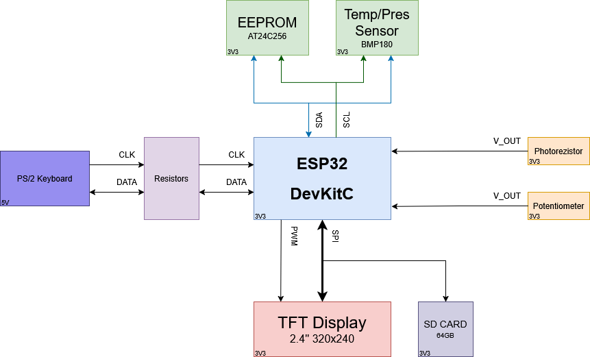
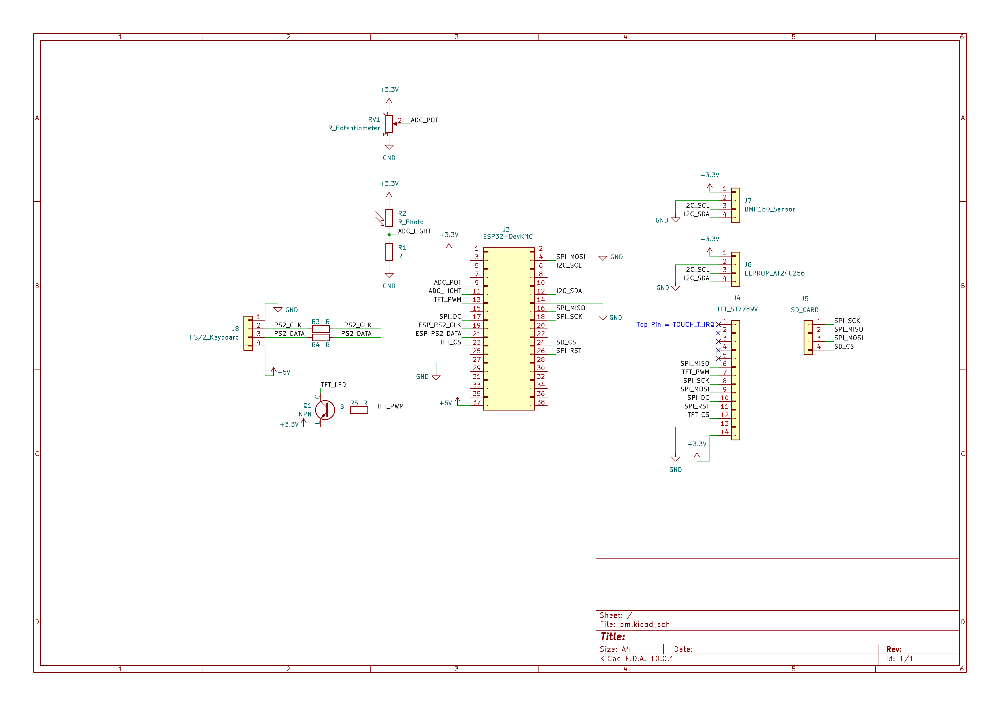

# ESP32 Data Logger and Graphing Terminal

**Author:** Lupoi Ștefan-Alexandru (Group: 335CA)

## Introduction

This project is a standalone data logging and visualization system based on the ESP32 microcontroller. The device reads data from analog and digital sensors (temperature/pressure, light) and renders the data in real-time on a color TFT display. The system can be operated entirely independently from a PC using a custom hardware interface and a standard PS/2 keyboard.

**The Scope of the Project:** The main objective is creating a set of portable tools capable of logging and storing physical data while offering the user a local control panel. Users can type commands to modify the sampling rate, graph scale, or to save/load data from memory.

**Why It Is Useful:** For regular users, the project serves as a practical visual instrument for monitoring the environment or testing analog signals (similar to a budget oscilloscope). For developers, it demonstrates how to write a driver from scratch for the PS/2 protocol (managing external interrupt timings) and coordinating multiple data buses (high-speed SPI for graphics and I2C for sensors and storage) without blocking operations.

### Block Diagram

## Hardware Design

### Electrical Diagram

### Bill of Materials
* **Microcontroller:** ESP32-WROOM-32D (DevKitC V4)
* **Display & Storage:** TFT SPI 2.4 inch display module (240x320 resolution) with integrated SD card reader slot
* **Non-volatile Storage:** MicroSD Card (formatted in FAT32) utilizing display's integrated reader
* **Input:** Standard PS/2 keyboard and female PS/2 connector
* **Non-volatile Memory:** EEPROM I2C AT24C256 (32K) (reserved / legacy storage)
* **Digital Sensors:** BMP180 (I2C) pressure and temperature sensor
* **Analog Sensors:** Photoresistor (type 5528) + 10kΩ resistor, 10kΩ potentiometer
* **Passive Components:** 1kΩ and 10kΩ resistors, BC547B NPN transistor
* **Infrastructure:** Breadboard and wires

## Software Design

### Development Environment
* **Platform:** PlatformIO (typically via VS Code)
* **Framework:** Arduino core for ESP32 (`espressif32`)

### Key Libraries
* **TFT_eSPI (v2.5.43):** Hardware-accelerated graphics driver configured for ST7789 over high-speed SPI.
* **LVGL (v9.1.0):** Core UI framework powering the menus, terminal overlay, and real-time charting.
* **Adafruit BMP085 Library:** Interface for the BMP180 sensor over I2C.
* **FS, SD, and SPI (Standard ESP32 Core):** Core filesystem and SPI drivers to read/write log files and handle dynamic data paging on-demand.

### Project Structure
* **`main.cpp`:** System orchestrator. Initializes hardware, bridges LVGL with display and keyboard drivers, and drives the main loop.
* **`graph.cpp` / `graph.h`:** Manages the LVGL charting subsystem, data acquisition, dynamic data windowing/mapping (panning and zooming), and SD card logging with dynamic cache-miss file paging.
* **`terminal.cpp` / `terminal.h`:** Implements the graphical terminal overlay, parsing commands and interfacing with graphing logic.
* **`menu.cpp` / `menu.h`:** Controls GUI-based settings configuration, including custom Save filename inputs and post-load Sensor Parameter selection submenus.
* **`ps2_keyboard.cpp` / `ps2_keyboard.h`:** Custom bare-metal PS/2 keyboard driver utilizing hardware interrupts and a circular buffer.

## Getting Started

1. Open the project in **PlatformIO**.
2. Make sure your hardware is wired according to the electrical diagram (refer to the full documentation).
3. Build and upload using the `esp32dev` environment configured in `platformio.ini`.
4. Connect the PS/2 keyboard and monitor data in real-time or interact with the built-in terminal!
